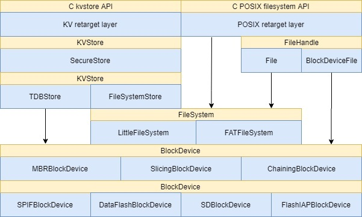
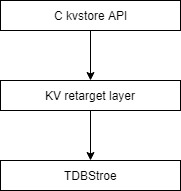
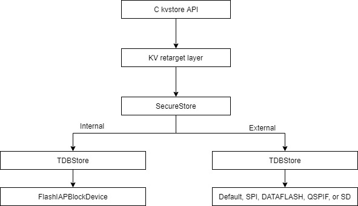
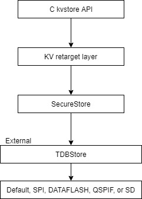
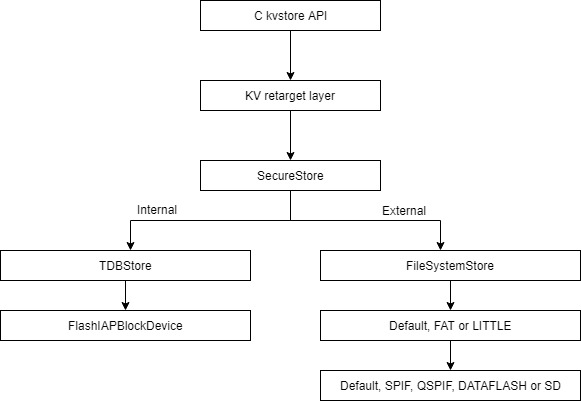
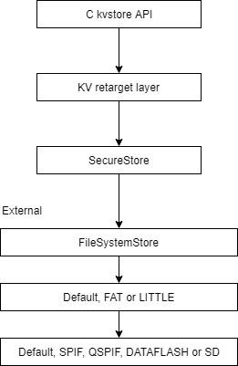

# Storage configuration 

This document describes the configurations of the mbed OS storage based on kv_store interface. 

## New Storage design


This document describes the configuration for the kvstore part (left side of the diagram above) and its underlying components such as filesystem and block devices.
The configuration concept is based on a number of pre-defined topologies (configurations) allowing customers to select one of them or to define also a user-defined topology.

The last section of this document will explain how to override the configuration option in order to enable storage configuration which is not supported by any of the configurations above.  
In order to use the default configurations, the storage_type parameter should be set to one of the configurations options available.
The implementation of the configuration is composed of a set json files and a set of functions instantiating and initializating the required components.

## Configuration structure
```
kvstore
│
└───conf
    │   mbed_lib.json
    │
    ├───tdb_external
    │       mbed_lib.json
    │
    ├───tdb_external_no_rbp
    │       mbed_lib.json
    │
    ├───filesystem
    │       mbed_lib.json
    │
    ├───filesystem_no_rbp
    │       mbed_lib.json
    │
    └───tdb_internal
            mbed_lib.json
```

The kvstore configuration file structure includes six configuration files. The topmost configuration file is used to set up the full configuration of the storage by defining a single parameter (storage_type) to one of the predefined configurations. The configuration files in the subfolders are used to implement the above top level configurations.

The configuration files can be found under `conf/<configuration name>`.
* conf/tdb_internal - storage type TDB_INTERNAL configuration is intended to be used when all data will be stored in internal memory only. No need for additional security features. A single TDBStore object will be allocated in internal flash.
* conf/tdb_external - storage type TDB_EXTERNAL configuration is providing full security and intended to be used when data is stored in external flash. It allocates: SecureStore, TDBStore in external flash and TDBStore in internal flash (for rollback protection - RBP)
* conf/tdb_external_no_rbp - storage type TDB_EXTERNAL_NO_RBP configuration allows security but without rollback protection. Similar to tdb_external but without the TDBStore in internal memory.
* conf/filesystem - This configuration will allocate: SecureStore, FileSystemStore, filesystem, TDBStore in internal memory and the required block devices. The allocated file system will be selected according to the COMPONENT set in targets.json, (FATFS for SD card and LITTLEFS for SPIF), however, this can be set differently by overiding the respective parameter. Use this configuration if you need the file system with POSIX API in addition to the set/get API.
* conf/filesystem_no_rbp - storage type FILESYSTEM_NO_RBP configuration allows security like FILESYSTEM configuration but without rollback protection.

A stand alone block device will be allocated for each component in internal and external memory and SD cards as required for the configurations. In any case, the full size of the memory allocated for each block device will be used by the respective component.

## Configuration parameters
The following is a list of all storage parameters available and their description. 

* storage_type - Used to select one of the pre-defined configurations.
    * TDB_INTERNAL
    * TDB_EXTERNAL
    * TDB_EXTERNAL_NO_RBP
    * FILESYSTEM
    * FILESYSTEM_NO_RBP
* default_kv - This is a string representing the path for the default kvstore instantiation. Applications can pass an empty path (only the key name) or pass the generated name for this parameter (MBED_CONF_STORAGE_DEFAULT_KV) as the path to use this configuration.
* internal_size - The size in bytes for the internal FlashIAP block device. This should enable together with the internal_base_address to adjust exactly the size and location where the block device resides on memory. If not defined the block device will try to get the maximum size available.
* internal_base_address - The address where the internal FlashIAP blockDevice starts. This helps to prevent collisions with other needs like firmware updates. If not defined the start address will be set to the first sector after the application code ends in TDB_internal while in any external configurations with rollback protection support it will be set to end of flash - rbp_internal_size.
* rbp_number_of_entries - set the number of entries allowed for rollback protection. The default is set to 64. This parameter controls the max number of different keys that can be created with rollback protection flag.
rbp_internal_size sets the size for the rollback protection TDBStore in the internal memory. the base address will be calculated as flash ends address - size.
* filesystem - Options are FAT, LITTLE or default. If not set or set to default the file system type will be selected according to the storage component selected for the board in targets.json file: FAT for "components": ["SD"] and Littlefs for "components": ["SPIF"].
* blockdevice - Options are default, SPIF, DATAFLASH, QSPIF or SD. If filesystem set to default this parameter is ignored.
* external_size - The size of the external block device in bytes. If not set the maximum available size will be used. 
* external_base_address - The start address of the external block device. if not set 0 address will be used.
* mount_point - mount point for the filesystem. This parameter will be ignored if the filesystem is set to default.
* folder_path - Path for the working directory where the FileSyetemStore stores the data

## Storage configuration

Below is the main storage configuration mbed_lib json file. 

```
{
"name": "storage",
    "config": {
        "storage_type": {
            "help": "Options are TDB_INTERNAL, TDB_EXTERNAL, TDB_EXTERNAL_NO_RBP, FILESYSTEM or FILESYSTEM_NO_RBP.",
            "value": "NULL"
        },
        "default_kv": {
            "help": "A string name for the default kvstore configurtaion",
            "value": "kv"
        }
    }
}
```
    
### TDB_INTERNAL
The internal configuration should be used for targets willing to save all the data in internal flash 



In this configuration, all kvstore C API will be mapped to the TDBStore in the internal flash. To use this configuration the storage_type parameter in storage mbed_lib.json should be set to TDB_INTERNAL. 

Below is the TDB_INTERNAL configuration mbed_lib.json
```
{
    "name": "tdb_internal",
    "config": {
        "internal_size": {
            "help": "Size of the FlashIAP block device",
            "value": "NULL"
        },
        "internal_base_address": {
            "help": "If not defined the default is the first sector after the application code ends.",
            "value": "NULL"
        },
        "rbp_number_of_entries": {
            "help": "If not defined default is 64",
            "value": "64"
        }
    }
}
```

For this configuration please define the section of the internal storage that will be used for data, by defining these parameters in your app.config file: internal_base_address and internal_size. If not defined, the storage will start in the first sector immediately after the end of the application. This can reduce the ability to update the application with a bigger one.

### TDB_External


TDB_EXTERNAL uses a TDBStore in the internal flash for security rollback protection and a TDBStore on the external flash for the data. This configuration all kvstore C API calls are mapped to work with the SecureStore class and this class will handle the use of the two TDBStores. Unless configured differently the external TDBStore will work on top of the default block device, while the internal TDBStore will work with the FlashIAPBlockdevice. 
The external TDBStore block device can be set to any of the following block devices. SPIF, QSPIF, DATAFASH and SD.

This configuration can be enabled by setting storage_type in storage mbed_lib.json to TDB_EXTERNAL.

Below is the TDB_EXTERNAL configuration mbed_lib.json
```
{

    "name": "tdb_external",
    "config": {
        "rbp_internal_size": {
            "help": "If not defined default size is 4K*#enteries/32",
            "value": "NULL"
        },
        "rbp_number_of_entries": {
            "help": "If not defined default is 64",
            "value": "64"
        },
        "internal_base_address": {
            "help": "If not defined the default is the first sector after the application code ends.",
            "value": "NULL"
        },
        "blockdevice": {
            "help": "Options are default, SPIF, DATAFASH, QSPIF or SD",
            "value": "NULL"
        },
        "external_size": {
            "help": "Size of the external block device",
            "value": "NULL"
        },
        "external_base_address": {
            "help": "If not defined the default is from address 0",
            "value": "NULL"
        }
    }
}
```

### TDB_External_no_RBP


TDB_EXTERNAL_NO_RBF Configuration has no support for rollback protection and therefore less secure.
The TDB_EXTERNAL_NO_RBP uses only one TDBStore on the external flash for all data. In this configuration all kvstore C API calls are mapped to work with the SecureStore class. The external TDBStore will work on top of the default block device however, external TDBStore block device can be set to any of the following block devices SPIF, QSPIF, DATAFASH and SD.


This configuration can be enabled by setting storage_type in storage mbed_lib.json to TDB_EXTERNAL_NO_RBP.

Below is the TDB_EXTERNAL_NO_RBP configuration mbed_lib.json
```
{
    "name": "tdb_external_no_rbp",
    "config": {
        "external_size": {
            "help": "Size of the external block device",
            "value": "NULL"
        },
        "external_base_address": {
            "help": "If not defined the default is from address 0",
            "value": "NULL"
        },
        "blockdevice": {
            "help": "Options are default, SPIF, DATAFASH, QSPIF or FILESYSTEM",
            "value": "NULL"
        }
    }
}
```

### FILESYSTEM


The FILESYSTEM configuration resembles the EXTERNAL with the difference that it uses FileSysytemStore on the external flash. By default, the FileSystemStore will use the default filesystem and the default block device.
In this configuration, all kvstore C API paths are mapped to the SecureStore class and this class will handle the use of the internal TDBStore or external FileSystemStore. 
This configuration can be enabled by setting storage_type in storage mbed_lib.json to FILESYSTEM. 

Below is the FILESYSTEM configuration mbed_lib.json
```
{
    "name": "filesystem_store",
    "config": {
        "rbp_internal_size": {
            "help": "If not defined default size is 4K*#enteries/32",
            "value": "NULL"
        },
        "rbp_number_of_entries": {
            "help": "If not defined default is 64",
            "value": "64"
        },
        "internal_base_address": {
            "help": "If not defined the default is the first sector after the application code ends.",
            "value": "NULL"
        },
        "filesystem": {
            "help": "Options are default, FAT or LITTLE. If not specified default filesystem will be used",
            "value": "NULL"
        },
        "blockdevice": {
            "help": "Options are default, SPIF, DATAFASH, QSPIF or FILESYSTEM. If not set the default block device will be used",
            "value": "NULL"
        },
        "external_size": {
            "help": "Size in bytes of the external block device, if not specified the maximum is the default.",
            "value": "NULL"
        },
        "external_base_address": {
            "help": "If not defined the default is from address 0",
            "value": "NULL"
        },    
        "mount_point": {
            "help": "Where to mount the filesystem. Ignored if the default file system is applied.",
            "value": "/sd"
        },
        "folder_path": {
            "help": "Path for the working directory where the FileSyetemStore stores the data",
            "value": "/kvstore"
        }
    }
}
```
If filesystem is not set the default filesystem and block device will be applied and blockdevice, external_size and external_base_address will be ignored.

### FILESYSTEM_NO_RBP


The FILESYSTEM_NO_RBP configuration resembles the EXTERNAL_NO_RBP with the difference that it uses FileSysytemStore on the external flash. By default, the FileSystemStore will use the default filesystem and the default block device. This Configuration has no support for rollback protection and therefore less secure.
in this configuration all kvstore C API calls are mapped to the SecureStore class and this class will handle the use of the external FileSystemStore.
This configuration can be enabled by setting storage_type in storage mbed_lib.json to FILESYSTEM_NO_RBF. 

Below is the FILESYSTEM configuration mbed_lib.json
```
{
    "name": "filesystem_store_no_rbp",
    "config": {
        "filesystem": {
            "help": "Options are default, FAT or LITTLE. If not specified default filesystem will be used",
            "value": "NULL"
        },
        "blockdevice": {
            "help": "Options are default, SPIF, DATAFASH, QSPIF or FILESYSTEM. If not set the default block device will be used",
            "value": "NULL"
        },
        "external_size": {
            "help": "Size in bytes of the external block device, if not specified the maximum is the default.",
            "value": "NULL"
        },
        "external_base_address": {
            "help": "If not defined the default is from address 0",
            "value": "NULL"
        },    
        "mount_point": {
            "help": "Where to mount the filesystem. Ignored if the default file system is applied.",
            "value": "/sd"
        },
        "folder_path": {
            "help": "Path for the working directory where the FileSyetemStore stores the data",
            "value": "/kvstore"
        }
    }
}
```

If filesystem is not set the default filesystem and block device will be applied and blockdevice, external_size and external_base_address will be ignored 

### Configuration functions API.
Applications must call the function **storage_configuration()** to instantiate the required configuration. This function is defined as weak to allow the replacement of this function with a completely different implementation of the instantiation of components.
Below is a list of setup functions that will be called by storage_configuration() in each case, and their description.

```
#if MBED_CONF_STORAGE_STORAGE == NULL 
define MBED_CONF_STORAGE_STORAGE USER_DEFINED
#endif

#define _STORAGE_CONFIG_concat(dev) _storage_config_##dev()
#define _STORAGE_CONFIG(dev) _STORAGE_CONFIG_concat(dev)

/**
 * @brief This function initializes internal memory secure storage
 *        This includes a TDBStore instance with a FlashIAPBlockdevice 
 *        as the supported storage. 
 *        The following is a list of configuration parameter
 *        MBED_CONF_STORAGE_INTERNAL_SIZE - The size of the underlying FlashIAPBlockdevice
 *        MBED_CONF_STORAGE_INTERNAL_BASE_ADDRESS - The start address of the underlying FlashIAPBlockdevice
 *        MBED_CONF_STORAGE_INTERNAL_RBP_NUMBER_OF_ENTRIES - If not defined default is 64
 * @returns true on success or false on failure.
 */
bool _storage_config_TDB_INTERNAL();

/**
 * @brief This function initialize external memory secure storage
 *        This includes a SecureStore class with TDBStore over FlashIAPBlockdevice 
 *        and an external TDBStore over a default blockdevice unless configured differently.
 *        The following is a list of configuration parameter:
 *        MBED_CONF_STORAGE_TDB_EXTERNAL_RBP_INTERNAL_SIZE - Size of the internal FlashIAPBlockDevice and by default is set to 4K*#enteries/32. The start address will be set to end of flash - rbp_internal_size.
 *        MBED_CONF_STORAGE_TDB_EXTERNAL_RBP_NUMBER_OF_ENTRIES - If not defined default is 64
 *        MBED_CONF_STORAGE_TDB_EXTERNAL_EXTERNAL_SIZE - Size of the external blockdevice in bytes or NULL for max possible size.
 *        MBED_CONF_STORAGE_TDB_EXTERNAL_EXTERNAL_BASE_ADDRESS - The block device start address.
 *        MBED_CONF_STORAGE_TDB_EXTERNAL_EXTERNAL_BLOCK_DEVICE - Alowed vlaues are: default, SPIF, DATAFASH, QSPIF or SD
 * @returns true on success or false on failure.
 */
bool _storage_config_TDB_EXTERNAL();

/**
 * @brief This function initialize a predefined external memory secure storage
 *        This includes a SecureStore class with external TDBStore over a blockdevice or, 
 *        if no blockdevice was set the default blockdevice will be used.
 *        The following is a list of configuration parameter:
 *        MBED_CONF_STORAGE_TDB_EXTERNAL_NO_RBP_EXTERNAL_SIZE - Size of the external blockdevice in bytes or NULL for max possible size.
 *        MBED_CONF_STORAGE_TDB_EXTERNAL_NO_RBP_EXTERNAL_BASE_ADDRESS - The block device start address
 *        MBED_CONF_STORAGE_TDB_EXTERNAL_NO_RBP_EXTERNAL_BLOCK_DEVICE - Alowed vlaues are: default, SPIF, DATAFASH, QSPIF or SD
 * @returns true on success or false on failure.
 */
bool _storage_config_TDB_EXTERNAL_NO_RBP();

/**
 * @brief This function initialize a predefined FILESYSTEM memory secure storage 
 *        This includes a SecureStore class with TDBStore over FlashIAPBlockdevice
 *        in the internal memory and an external FileSysteStore. If blockdevice and filesystem not set, 
 *        the system will use the default block device and default filesystem
 *        The following is a list of configuration parameter:
 *        MBED_CONF_STORAGE_FILESYSTEM_RBP_INTERNAL_SIZE - Size of the internal FlashIAPBlockDevice and by default is set to 4K*#enteries/32. The start address will be set to end of flash - rbp_internal_size.
 *        MBED_CONF_STORAGE_FILESYSTEM_RBP_NUMBER_OF_ENTRIES - If not defined default is 64
 *        MBED_CONF_STORAGE_FILESYSTEM_FILESYSTEM - Allowed values are: default, FAT or LITTLE
 *        MBED_CONF_STORAGE_FILESYSTEM_BLOCKDEVICE - Allowed values are: default, SPIF, DATAFASH, QSPIF or SD 
 *        MBED_CONF_STORAGE_FILESYSTEM_EXTERNAL_SIZE - External Blockdevice size in bytes or NULL for max possible size. 
 *        MBED_CONF_STORAGE_FILESYSTEM_EXTERNAL_BASE_ADDRESS - The block device start address.
 *        MBED_CONF_STORAGE_FILESYSTEM_MOUNT_POINT - Where to mount the filesystem
 *        MBED_CONF_STORAGE_FILESYSTEM_FOLDER_PATH - The working folder paths
 *        
 * @returns true on success or false on failure.
 */
bool _storage_config_FILESYSTEM();

/**
 * @brief This function initialize a predefined FILESYSTEM_NO_RBP memory secure storage with no 
 *        rollback protection. This includes a SecureStore class an external FileSysteStore over a default 
 *        filesystem with default blockdevice unless differently configured.
 *        The following is a list of configuration parameter:
 *        MBED_CONF_STORAGE_FILESYSTEM_NO_RBP_FILESYSTEM - Allowed values are: default, FAT or LITTLE
 *        MBED_CONF_STORAGE_FILESYSTEM_NO_RBP_BLOCKDEVICE - Allowed values are: default, SPIF, DATAFASH, QSPIF or SD
 *        MBED_CONF_STORAGE_FILESYSTEM_NO_RBP_EXTERNAL_SIZE - Blockdevice size in bytes. or NULL for max possible size. 
 *        MBED_CONF_STORAGE_FILESYSTEM_NO_RBP_EXTERNAL_BASE_ADDRESS - The block device start address.
 *        MBED_CONF_STORAGE_FILESYSTEM_NO_RBP_MOUNT_POINT - Where to mount the filesystem
 *        MBED_CONF_STORAGE_FILESYSTEM_NO_RBP_FOLDER_PATH - The working folder paths
 *        
 * @returns true on success or false on failure.
 */
bool _storage_config_FILESYSTEM_NO_RBP();

MBED_WEAK bool storage_configuration()
{
    return _STORAGE_CONFIG(MBED_CONF_STORAGE_STORAGE_TYPE);
}
```

### Override user-defined setup
in order to create a much more complex setup including using other block devices such as MBRBlockDevice or SlicingBlockDevice, there is a need to override the storage_configuration function and generate any storage configuration of choice. 


